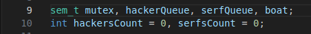
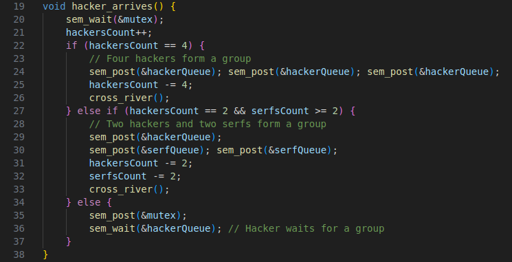
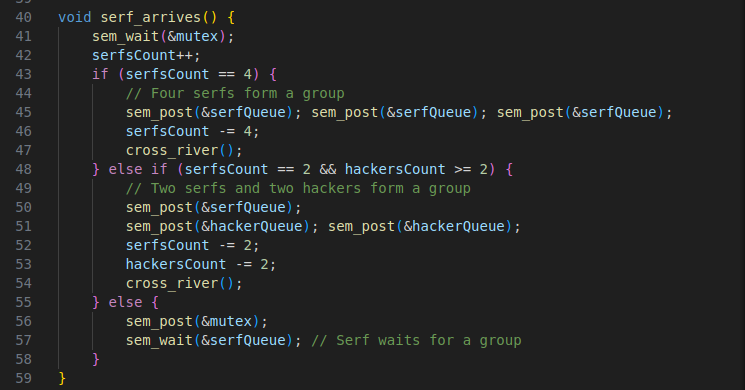
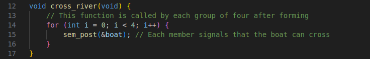
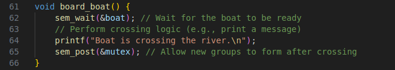
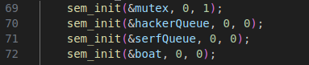
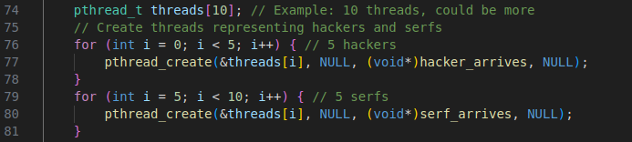
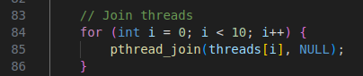
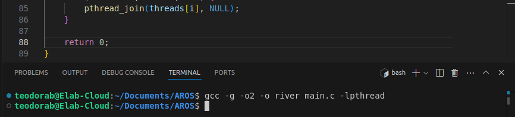
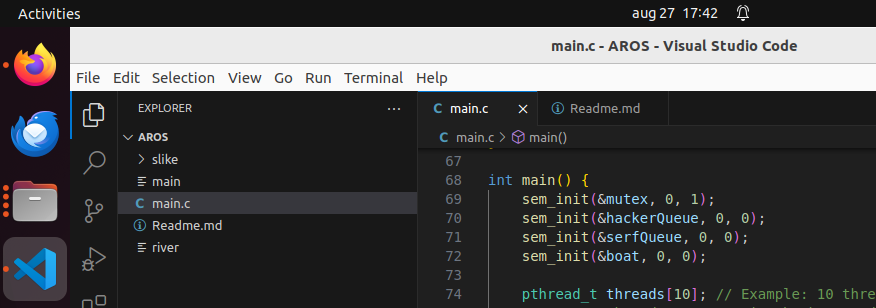

# Projekat

## River Crossing Problem - objašnjenje

Postoji grupa hakera i radnika Microsoft-a, koji treba da pređu reku koristeći čamac. U taj čamac može da stane 4 osobe, ali postoje određena pravila koja moraju da se ispoštuju da bi se obezbedio siguran prelaz i da bi čamac isplovio.
Pravila su sledeća:
1. Čamac mora da ima tačno 4 osobe.
2. U čamcu ne sme biti više od dva hakera, ili više od dva radnika.
3. Dozvoljena kombinacija putnika u čamcu je tačno dva hakera i tačno dva radnika.
Cilj je da se pokreti sinhronizuju tako da sva pravila budu ispoštovana.

## Kod

### Globalne promenljive

Prvo se navode promenljive koje su tipa sem_t (semafori).
1. mutex : Ova promenljiva služi da osigura međusobno isključivanje prilikom pristupa zajedničkim resursima.
2. hackerQueue, serfQueue : Promenljive koje se koriste za blokiranje i oslobađanje niti (hakeri i radnici) koji čekaju da se ukrcaju na čamac.
3. boat : Promenljiva koja kontroliše pristup čamcu; dozvoljava samo četiri osobe da se ukrcaju na čamac i pređu reku.

Zatim se navode promenljive tipa int (brojači).
Tu imamo hackersCount i serfsCount, koje prate broj hakera i radnika koji čekaju da se ukrcaju na čamac.

### Funkcija hacker_arrives()

1. sem_wait(&mutex) zaključava kritičnu sekciju koda kako bi se sprečilo utrkivanje za resurse prilikom promena promenljivih hackersCount i serfsCount.
2. Postavljaju se uslovi: 
    Ako je hackersCount == 4, tada se četiri hakera ukrcaju na čamac. Zatim se ostale niti koje čekaju da se ukrcaju oslobode, a hackersCount se resetuje na vrednost 0.
    Ako je hackersCount == 2 i serfsCount >= 2 (radnika ima barem dva), tada oni mogu da se grupišu i ukrcaju u čamac. Preostali (neukrcani) hakeri i radnici se oslobađaju iz redova (hackerQueue i serfQueue), a brojači se takođe menjaju.
3. sem_post(&hackerQueue) oslobađa hakera koji čeka da se ukrca na čamac.
4. sem_post(&serfQueue) oslobađa radnika koji čeka da se ukrca na čamac.
5. cross_river() signalizira da je ukrcan čamac spreman da pređe reku (svi uslovi su ispoštovani).
6. sem_wait(&hackerQueue) ukoliko uslovi nisu ispunjeni, haker ostaje da čeka u redu.

### Funkcija serf_arrives()

Logika je ista kao i za funkciju hacker_arrives().

### Funkcija cross_river()

Ova funkcija signalizira da je čamac spreman da se iskrca i pređe reku. Poziva se kada se formira validna grupa od četiri, bilo da su sve hakeri, sve radnici, ili grupe od po dva hakera i dva radnika.

### Funkcija board_boat()

1. sem_wait(&boat) čeka signal da je čamac spreman za prelazak.
2. sem_post(&mutex) oslobađa mutex nakon što čamac pređe reku, dozvoljavajući drugim grupama da počnu da se formiraju.

### main

1. Inicijalizacija semafora

    - sem_init(&mutex, 0, 1) inicijalizuje mutex semafor sa početnom vrednošću 1. Obezbeđuje međusobno isključivanje prilikom pristupanja deljenim resursima (hackersCount, serfsCount).
    - sem_init(&hackerQueue, 0, 0) inicijalizuje semafor hackerQueue sa početnom vrednošću 0. Koristi se da natera hakerske niti da čekaju dok im se ne dozvoli da se ukrcaju na čamac. Isto je i za serfQueue.
    - sem_init(&boat, 0, 0) inicijalizuje semafor boat sa početnom vrednošću 0. Signalizira kada je čamac spreman da pređe reku sa pravilno formiranom grupom.

2. Kreiranje niti

    - thread_t[10] deklariše niz od 10 objekata niti. Program će kreirati 10 niti za simulaciju 5 hakera i 5 radnika.
    - kroz petlje se formiraju 5 niti za hakere (koje će pokretati hacker_arrives() funkciju) i 5 niti za radnike (koje će pokretati serf_arrives() funkciju).
    - Funkcija pthread_create kreira novu nit koja počinje da izvršava funkcije hacker_arrives() ili serf_arrives() u zavisnosti od potreba. Identifikator niti se čuva u nizu niti, a funkcija se izvršava kao posebna nit.

3. Pridruživanje niti

    - Funkcija pthread_join se koristi za čekanje da svaka nit završi svoje izvršavanje. Ovim putem se osigurava da se glavna funkcija ne prekida sve dok sve hakerske i radničke niti ne završe svoje zadatke.
    - Petlja se ponavlja preko svih 10 niti, pridružujući svaku glavnu nit.

## Kompajliranje

Kod se kompajlira tako što se u terminalu ispiše komanda: gcc -g -o2 -o river main.c -lpthread. 

Nakon toga se oslobađa terminal (dostupan je za dalje korišćenje, nije zamrznut), a u folderu možemo primetiti da se kreirao fajl pod nazivom river, koji predstavlja kompajliranu verziju koda, koji je spreman za izvršenje.

